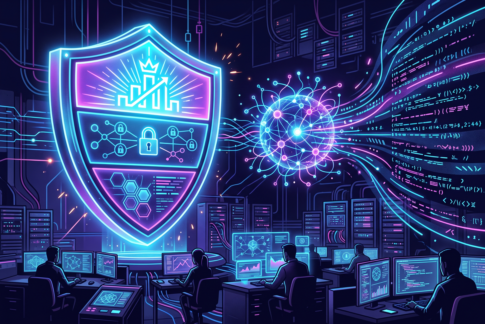

Anthropic anunció el 6 de octubre la expansión de su **Cyber Verification Program (CVP)**, que absorbe y ordena lo que hasta ahora era el proyecto piloto **Glasswing**: acceso verificado a sus modelos más capaces —incluido **Claude Mythos**— para profesionales de seguridad, con clasificadores de bloqueo relajados para que el modelo pueda hacer su trabajo ofensivo/defensivo sin pelearse con los guardrails.

## Tres niveles, tres casos de uso

1. **Defense Access**: para respuesta a incidentes y validación de vulnerabilidades.
2. **Red Team Access**: para organizaciones autorizadas de pentesting.
3. **Specialized Access**: para sistemas críticos de seguridad — piensa sistemas operativos de vuelo o redes eléctricas — con controles adicionales.

Todos los niveles incluyen acceso a **Opus 5.5, Sonnet 5.5 y Mythos**, más los modelos futuros.

## Los números que justifican el programa

La justificación es dura de discutir: entre abril y julio de 2026, los partners de Glasswing descubrieron **más de 129.000 fallos de software verificados**, de los cuales **más de 33.000 eran críticos o de severidad alta**. No es teoría de laboratorio: ya vimos acá cómo Mythos encontró el CVE-2026-61500 en Rejetto HFS y fue explotado in the wild en menos de 24 horas.

## El contexto que le da sabor

La movida llega en pleno debate sobre el riesgo cibernético de los modelos. Mientras Nathan Lambert (Interconnects) argumenta que el pánico por los open weights está sobredimensionado —citando que el release abierto de GLM-5.3 no produjo ola de ataques— Anthropic apuesta por la vía intermedia: **los modelos más capaces disponibles para seguridad, pero con verificación de identidad y controles por nivel**. La tensión "open weights vs. acceso verificado" va a seguir definiendo esta discusión, y el CVP es la apuesta estructurada de Anthropic por el segundo camino.

**Fuentes:** [Anthropic](https://www.anthropic.com/news) · [Firstpost](https://www.firstpost.com/tech/anthropic-opens-its-most-powerful-ai-models-to-more-security-teams-14051013.html)
