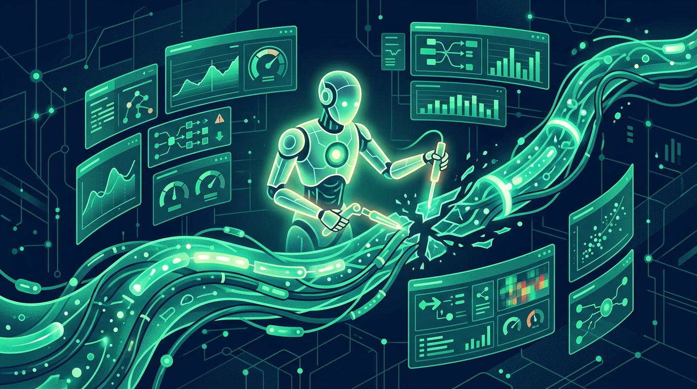

Dynatrace (NYSE: DT) completó la compra de **Arize**, la plataforma de AI observability y evaluación conocida por su trabajo en tracing y evaluación de modelos y agentes. La movida cierra un hueco que ya era evidente: hoy todos monitoreamos la infraestructura clásica, pero ¿quién monitorea a los agentes de IA que toman decisiones por su cuenta en producción?

## Qué combina la jugada

- **Arize aporta**: tracing AI-nativo, evaluación de modelos/agents y experimentación — lo que en la jerga llaman "continual learning for agents", o sea, saber qué hizo tu agente, si el resultado se sostuvo y cómo mejorarlo.
- **Dynatrace aporta**: observabilidad de aplicaciones, infraestructura y procesos de negocio (Smartscape, Davis AI).

Juntos apuntan a lo que Dynatrace llama **full-lifecycle AI observability**: visibilidad desde el desarrollo hasta producción, en una sola plataforma. En palabras del propio anuncio: Arize muestra lo que una aplicación o agente de IA *realmente hizo* y si el resultado se sostuvo; Dynatrace muestra el servicio, la infraestructura y el proceso de negocio alrededor.

## El contexto: el monitoring se está tragando el LLMOps

Esto no es un caso aislado, es una consolidación de mercado a toda velocidad:

- **Datadog** compró Adaptive ML (junio 2026) para acelerar operaciones autónomas con IA sobre datos de observabilidad.
- La tesis general: los equipos ya no aceptan que el LLM/agent sea una caja negra entre el request y la respuesta. Quieren traces, evals y alertas con el mismo rigor que aplican a un microservicio.

## El ángulo agéntico

La pieza que más me interesa del análisis de esta semana en The New Stack: la dirección de Dynatrace no es generar **más alertas**, sino que sus agentes de IA **arreglen problemas**. La promesa pasa de "te aviso que algo está mal" a "identifiqué el problema en el camino crítico, tengo el contexto completo de Arize + Dynatrace, y lo remedié". Con 96% de las empresas operando ya con IA generativa en algún flujo crítico, el cuello de botella dejó de ser el modelo y pasó a ser la confianza operacional.

## Qué mirar de acá en adelante

1. Integración de las evals de Arize con Davis AI (el motor causal de Dynatrace) — si es solo coexistencia de productos, la tesis se debilita.
2. Migración de clientes Arize standalone y qué pasa con los precios.
3. La respuesta de Datadog, New Relic y Elastic — todos están jugando la misma mano.

La observabilidad nació para microservicios, se adaptó a Kubernetes, y ahora el siguiente territorio es la IA misma. Dynatrace acaba de comprar su boleto.

**Fuentes:** [Dynatrace — Completes acquisition of Arize](https://www.dynatrace.com/news/press-release/dynatrace-completes-acquisition-of-arize/) · [Dynatrace Blog](https://www.dynatrace.com/news/blog/dynatrace-completes-acquisition-of-arize/) · [The New Stack — Dynatrace wants its AI agents to fix problems instead of adding alerts](https://thenewstack.io/dynatrace-arize-ai-observability/) · [BigDATAwire](https://www.hpcwire.com/bigdatawire/this-just-in/dynatrace-completes-acquisition-of-arize-extending-ai-observability-across-full-development-lifecycle/)
