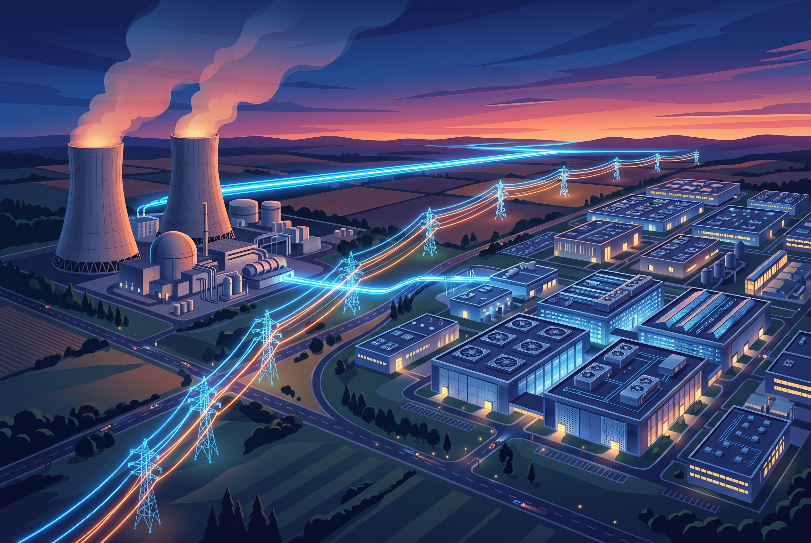

La carrera de la IA dejó de pelearse solo en chips: ahora se pelea en la red eléctrica. Google anunció un acuerdo landmark con **Constellation Energy** por **3.590 MW** de capacidad, dentro del marco *bring your own power* de PJM (el operador de red de la costa este de EE.UU.), pensado para alimentar sus data centers de IA.

## Los números del contrato

- **890 MW de energía nuclear nueva** vía un PPA de 20 años, proveniente de **11 upgrades de reactores** en Illinois, Pensilvania y Nueva Jersey — ni un reactor nuevo desde cero, sino capacidad extra extraída de las plantas existentes. ~25% del total viene de nuclear nueva.
- **2.700 MW adicionales** desde otras fuentes bajo contratos de largo plazo.
- El acuerdo gatilla **más de US$4.300 millones de inversión** de Constellation.
- Las primeras entregas arrancan en **2028**.

## Por qué importa

- **El cuello de botella de la IA es energético.** Ya vimos que Google está declinando contratos con clientes externos por falta de capacidad de cómputo, y que su próximo chip (Frozen v2) apunta precisamente al crunch. Firmar capacidad con una década de horizonte es ahora estrategia de plataforma, no un detalle de facilities.
- **Los upgrades de reactores son el atajo realista.** Extender la vida y potencia de plantas existentes es más rápido y barato que construir reactores nuevos, que en EE.UU. llevan años de retraso. Ojo con el patrón para quien haga planning de capacidad: los MW "nuevos" de los próximos 5 años salen mayoritariamente de upgrades, no de greenfield.
- **Bring your own power se consolida.** Las big tech dejaron de esperar a la red pública y traen su propia generación al grid. Para el ecosistema cloud, cada MW firmado hoy es una región de inferencia asegurada mañana.

**Fuentes:** [Google Cloud Press](https://www.googlecloudpresscorner.com/press-releases) · [Business Standard](https://www.business-standard.com/topic/google-cloud)
