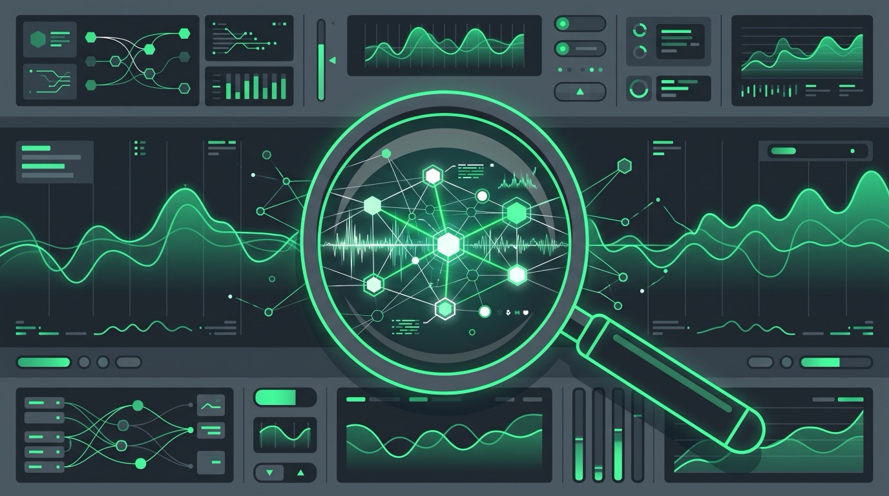

La observabilidad de aplicaciones IA pasó de tema de conferencia a requisito de producción, y New Relic entró con todo: anunció **AI Evaluation**, una capa de evaluación para su plataforma de AI Observability, junto con el **Ground Truth CLI** e **Infrastructure 360**. Tres anuncios que apuntan al mismo problema: saber si tu app con LLMs está funcionando bien, no solo si está funcionando.

## AI Evaluation: LLM-as-a-judge sobre tu telemetría

La idea central: el monitoreo tradicional te dice la latencia y el uptime, pero no si el modelo **respondió con algo útil, alucinó o filtró datos sensibles**. AI Evaluation ataca eso con un servicio asíncrono de "LLM-as-a-judge" que escanea la telemetría en vivo y puntúa problemas como alucinaciones, inyecciones de prompt y data leaks.

Lo interesante es el nivel de análisis: evalúa **a nivel de transacción**, no de llamada individual al LLM, y **adjunta los scores como atributos a los distributed traces**. Así podís ver en un solo lugar si el fallo vino del prompt, del RAG, del modelo o del backend. Además conecta el scoring de calidad con el consumo de compute, para responder la pregunta que todos se hacen en la reunión de presupuesto: ¿el modelo caro realmente entrega mejor resultado que el barato?

Incluye evaluadores pre-construidos, un prompt playground para comparar side-by-side, datasets reutilizables para testing de regresión y experimentos controlados entre prompts, modelos y configuraciones.

## Ground Truth CLI e Infrastructure 360

- **Ground Truth CLI**: una ruta de línea de comandos hacia la investigación y recuperación de incidentes, pensada tanto para desarrolladores como para **agentes de IA** — New Relic asume explícitamente que los próximos on-call van a incluir bots.
- **Infrastructure 360**: la apuesta para acelerar el diagnóstico de infraestructura, integrando esa capa con el resto de la plataforma.

## El contexto

Con Dynatrace comprando Arize la semana pasada y todos los grandes (Datadog, Splunk, Honeycomb) empujando capacidades para IA, el mercado de "AI observability" se está definiendo a punta de lanzamientos. La tesis de New Relic es que la calidad del output de IA es una señal de observabilidad más, al mismo nivel que latency o error rate — y que vive pegada a los traces, no en una herramienta aparte.

Suena razonable. El que tenga apps con LLMs en producción ya sabe que el mayor dolor no es saber *si* falló, sino *por qué respondió cualquier cosa*. Esto apunta directo ahí.

**Fuente:** [Security Brief](https://securitybrief.news/story/new-relic-launches-ai-evaluation-for-production-safety) · Anuncios de New Relic, 6 de octubre de 2026.
