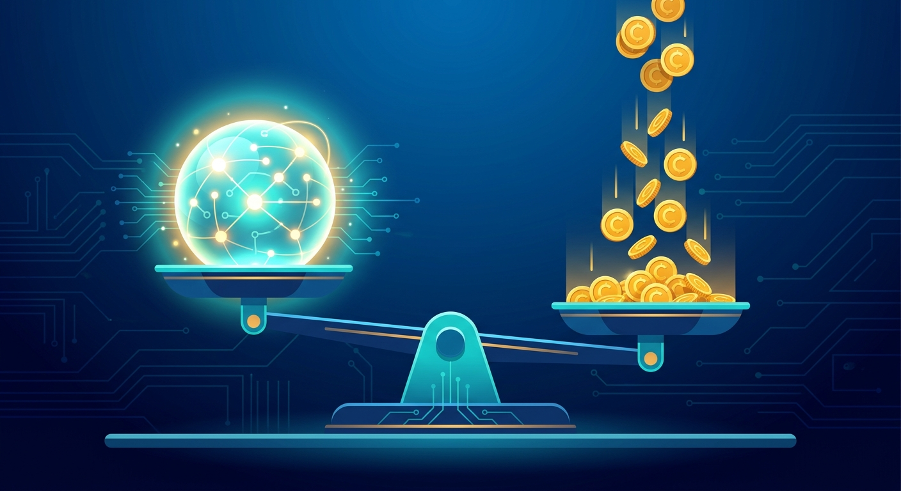

Anthropic sacó [Claude Haiku 5.5](https://www.anthropic.com/claude-haiku-5-5) y la noticia no es solo el modelo: es la tarifa. El modelo pequeño de la familia Claude llega con **recortes de precio de hasta 90% en la API** para requests de menos de 100.000 tokens, ubicándose exactamente en la línea de GPT-6 Luna de OpenAI. La guerra de precios que DeepSeek empezó ya tiene a todos los grandes peleando por el mismo piso.

## Los números, sin crema

- **Prompts bajo 100K tokens: US$0,10 por millón de tokens de entrada y US$0,50 por millón de salida.**
- **Prompts sobre 100K tokens: US$0,50 / US$2,50 por millón.**
- En promedio, Anthropic dice que **cuesta ~75% menos correr Haiku 5.5 que Haiku 4.5**.
- Contexto de **1M tokens**, al nivel de los front-runners.

¿Por qué el escalón en 100K? Simple: la mayoría del trabajo empresarial real — resumir documentos, clasificar información, extraer datos, rutear tickets — son prompts cortos y masivos. Ese es exactamente el segmento donde el costo por volumen mataba los business cases de IA. Con US$0,10/M de entrada, ese tipo de pipelines deja de dar miedo en la boleta.

## No vino solo

Junto con el lanzamiento, Anthropic movió otras piezas del tablero:

- **Sonnet 5.5 abarata la lectura de caché**, lo que incentiva aún más el patrón de system prompts largos + contexto cacheado.
- **Créditos mensuales de API para planes Max** (US$100–200) y **hasta US$500 para Teams**, bajando la fricción para que equipos chicos construyan sobre la API en vez de solo el chat.
- Disponibilidad desde el día uno en **AWS Bedrock, Google Cloud Vertex y Azure**, más llegada a **GitHub Copilot**.

## El contexto: todos corriendo hacia el piso

- **DeepSeek** fijó el piso del mercado: V4 Pro quedó en US$0,435/0,87 por millón tras un recorte que se hizo permanente, y V4 Flash en US$0,14/0,28 es el modelo usable más barato del mercado.
- **Z.AI** largó **GLM 5.3 Fast** el 7 de octubre, siguiendo su ritmo de releases casi mensuales desde julio.
- OpenAI, por su parte, ya mostró con GPT-6.1 Sol que la jugada es "misma precisión, 18% del costo".

### Update: 9 de octubre — Artificial Analysis le pone peros a la fiesta

Llegaron los números independientes y el cuadro se matiza. [Artificial Analysis](https://artificialanalysis.ai/articles/claude-haiku-5-5) evaluó Haiku 5.5 y hay de todo:

- **Inteligencia: cumple.** 43 puntos en el Intelligence Index (máximo esfuerzo), por encima de GLM-5.3 Flash (42), Gemini 3.8 Flash (41) y GPT-6 Luna (38), y comparable al open-weight Kimi K3 (44, un modelo de 2,8T parámetros). Subió 26 puntos respecto al Haiku del año pasado.
- **Agéntico: sorprende.** 33% en Terminal-Bench 4.0 — el Haiku 4.5 sacaba literal **0%**. Y en AA-Briefcase (trabajo de conocimiento realista) alcanza 1578 Elo, por encima de Kimi K3 y GLM-5.3.
- **El pero: se come los tokens.** En esfuerzo máximo usa ~162k tokens de salida por tarea, **unas 3 veces lo que gasta GPT-6 Luna** (~50k) para inteligencia similar. Traducción: el precio por token es bajísimo, pero el costo **por tarea** se puede parear. La guerra de precios ahora también se pelea en eficiencia de tokens.
- **Bug conocido:** en AutomationBench-AA marca 35% contra 53–60% de sus rivales, pero Artificial Analysis aclara que hay un problema de **sobre-rechazo por safistas** en el pre-release que Anthropic ya está parchando; esperan que la cifra suba al re-medir.
- **Detalle curioso:** menos conocimiento factual (36% en AA-Omniscience) pero con la **tasa de alucinación más baja** de su clase (40% vs 55% de Gemini Flash y 77% de Luna). Prefiere decir "no sé" antes que inventar — para trabajo empresarial, eso vale oro.

Conclusión del update: barato sí, pero conviene mirar el costo por tarea y no solo el precio por token antes de migrar pipelines.

La lectura es directa: **la diferenciación por "inteligencia pura" del modelo pequeño se acabó**. Haiku 5.5, Luna y Flash compiten en la misma franja de precio, y para workloads de alto volumen la decisión va a pasar más por latencia, ecosistema y herramientas que por puntos de benchmark.

## ¿Cuándo importa esto?

Si tenís pipelines que hacen clasificación, extracción o resumen masivo con modelos chicos, esto es motivo de recalculo: revisa el costo por millón de tokens de tu proveedor actual contra US$0,10/0,50 y probablemente la cuenta cierre para migrar o renegociar. Y si tu workload tiene prompts largos (RAG con contexto gordo), ojo con el salto tarifario sobre 100K — ahí el ahorro se come.

La conclusión de mercado: el modelo "económico" dejó de ser el mal menor. Al precio de Haiku 5.5, usar un modelo frontier-chico para el 90% del volumen y reservar el grande para lo difícil es simplemente la arquitectura correcta.
