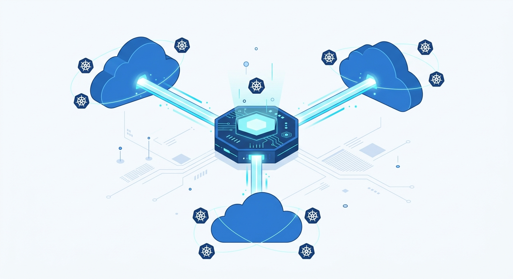

Microsoft puso en **preview pública** el Multicloud Connector de Azure Arc, y es una jugada de control plane que vale la pena mirar aunque no seas casa Azure: el connector ahora puede **descubrir clusters de Amazon EKS y Google GKE y enrolarlos automáticamente en Azure Arc-enabled Kubernetes**, sin que los clusters se muevan de su nube de origen ni nadie escriba un script de onboarding a mano.

## ¿Qué hace exactamente?

Hasta ahora, conectar un cluster externo a Arc era un proceso manual por cluster: instalar agentes, registrar recursos, mantener todo eso cuando los clusters cambian. El Multicloud Connector cambia el modelo:

- **Descubrimiento automático** de clusters EKS y GKE en tus cuentas y proyectos de AWS/GCP.
- **Onboarding seleccionable**: filtras qué clusters quieres enrolar y el connector se encarga del resto.
- Los clusters **siguen corriendo en su nube original**; lo que gana Azure es la capa de gestión: inventario, gobernanza y visibilidad unificada desde el portal.

## Por qué importa (aunque suene a marketing)

La promesa de Arc siempre fue "Azure como plano de control de todo lo que no está en Azure". Con Kubernetes ganando en todas partes, el dolor real de los equipos multicloud ya no es levantar clusters — es **llevar la cuenta de cuántos tenís, dónde están y quién los parchea**. Un connector que mantiene el inventario sincronizado solo ataca exactamente ese problema.

Y el timing no es casual: en las últimas semanas vimos a Google lanzar herramientas de migración EKS→GKE y a todo el ecosistema empujar la narrativa multicloud. La pelea ya no es solo por dónde corren tus workloads, sino **por quién administra la vista consolidada** — que en la práctica es donde se quedan las suscripciones enterprise.

## Lo que hay que tener claro

- Es **preview pública**: expectativas de SLA y estabilidad acordes.
- El enrolamiento en Arc **no migra nada**: los workloads, el data plane y la facturación siguen donde están. Es gestión, no rehosting.
- Para que tenga sentido necesitás el stack de Azure del lado de la administración (policy, monitoring, etc.). Si tu operación es 100% AWS o 100% GCP, esto no es para ti — y esa es justamente la jugada de Microsoft: capturar la capa de gobernanza de las nubes rivales.

Multicloud como arquitectura sigue siendo discutible; multicloud como *hecho consumado* en la mayoría de las empresas, no. Herramientas así asumen lo segundo y van directo por el costo real: la fragmentación operativa. Veremos si el connector llega a GA con las mismas pretensiones.
