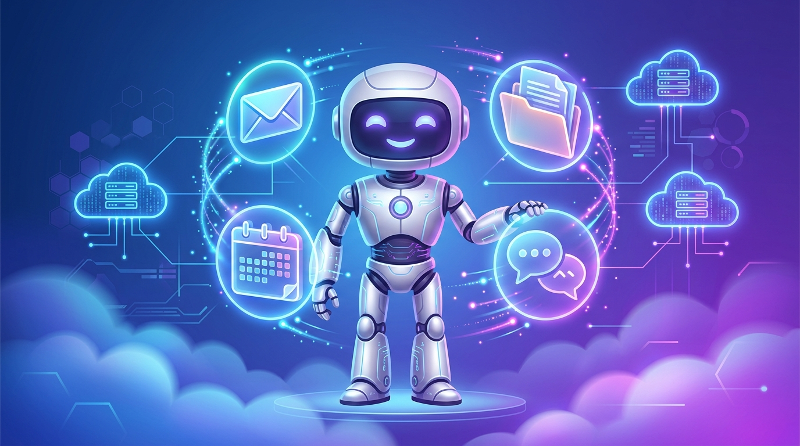

En su evento **Gemini at Work 2026**, Google Cloud hizo una apuesta fuerte por el trabajo agentico de larga duración: un **agente Gemini "universal" para empresas** que no vive dentro de una conversación, sino que **persiste por horas o días**, orquesta sub-agentes y se conecta con **Google Workspace, Microsoft 365 y Slack**.

## Un agente con identidad propia

El detalle más llamativo (y polémico, si lo piensas dos segundos): **cada agente recibe su propia cuenta dedicada de Workspace**, con dirección de Gmail, calendario y almacenamiento Drive incluidos. Es literalmente "contratar" un asistente digital con credenciales propias: puede agendar, recibir correos, guardar archivos y retomar el hilo del trabajo al día siguiente, igual que un empleado distribuido.

La arquitectura apunta a que el agente descomponga tareas largas, delegue en **sub-agentes** especializados y consolide resultados. Y en un giro pragmático para no encerrarse en su propio ecosistema: Google dice que el agente puede **rutear hacia Anthropic Claude**, además de modelos propietarios y open-weight. El message es claro — la capa de orquestación es de Google; el cerebro, negociable.

## El contexto competitivo

Con esto, Google Cloud se posiciona directo contra **Microsoft Azure y AWS** en la pelea por el gasto empresarial en IA, donde la nueva batalla no es "quién tiene el mejor modelo" sino **quién administra mejor la fuerza laboral agéntica**: identidad, permisos, persistencia y auditoría de agentes que actúan en nombre de personas y procesos.

Para los equipos de plataforma esto abre preguntas concretas y urgentes: gobernanza de esas cuentas-agente, límites de acceso a Microsoft 365 y Slack, trazabilidad de decisiones, y qué pasa cuando un agente persistente "olvida" que su tarea ya terminó. Los agentes con casilla propia son una idea elegante... y un nuevo hueco en el modelo de amenazas de toda organización.
