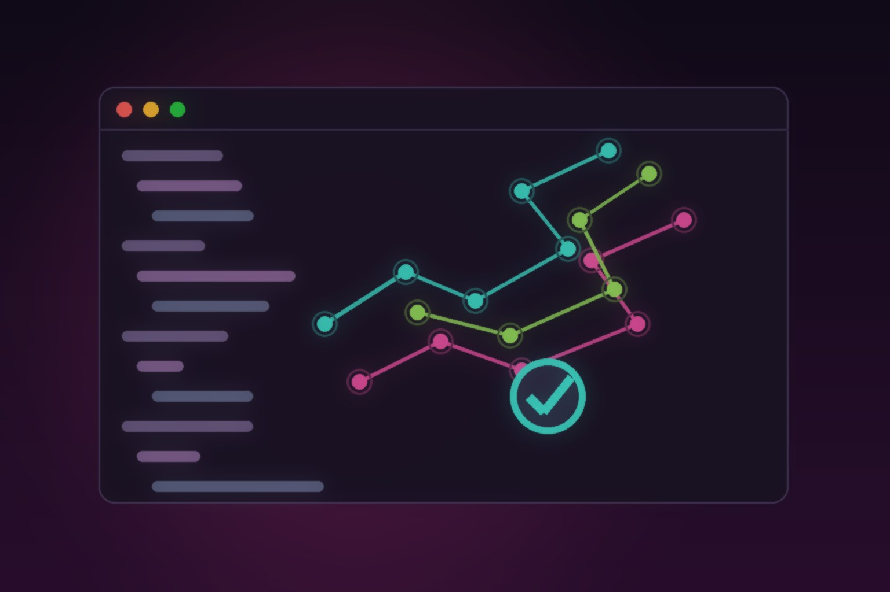

Splunk acaba de liberar **Observability Studio**, un proyecto nuevo, **gratuito y open source** (vive bajo la organización signalfx en GitHub) que ataca uno de los dolores más viejos de la observabilidad: **la instrumentación siempre pierde contra las features… hasta que hay un incidente**. La apuesta: mover la instrumentación al momento de crear el código, sin salir del IDE.

## Qué hace exactamente

El flujo que propone Observability Studio es un ciclo de validación repetible antes de que el cambio llegue a producción:

- **Audita tu instrumentación**: revisa qué servicios y señales detecta en tu proyecto, identifica gaps de instrumentación o configuración, y prioriza los huecos que bloquean el troubleshooting útil.
- **Completa lo que la auto-instrumentación no puede saber**: agrega los **custom spans y métricas** que solo alguien (o algo) que entiende tu lógica de negocio puede proponer — y luego **verifica que la telemetría realmente existe**.
- **Workspace de telemetría local**: trazas, métricas, logs, servicios, validación y previews de dashboards corriendo en tu máquina, con export opcional a Splunk Observability Cloud.
- **Skills para agentes de código**: el proyecto se instala como entorno para tu coding agent (por ejemplo, `./obstudio install --target=codex`) y le entrega un workflow OpenTelemetry **respaldado por evidencia** que podés inspeccionar desde el editor. También está disponible como extensión en Open VSX.

## El detalle interesante

No es solo "otro dashboard": la movida conecta dos tendencias que venían en carriles separados — la adopción masiva de **OpenTelemetry** como estándar de facto y los **agentes de código** como nuevos integrantes del equipo de desarrollo. Splunk está apostando que el próximo punto de control de la observabilidad no está en el cluster ni en la plataforma de monitoreo, sino **en el momento exacto en que se escribe el código**.

Y para los equipos que ya usan OTel, el pitch es directo: Observability Studio "acorta la distancia entre 'instalamos el SDK' y 'podemos usar la telemetría'". Auditar spans, seguir una request por el waterfall completo, correlacionar logs con contexto de traza y validar que los dashboards sigan reflejando lo que crees monitorear — todo como un chequeo pre-ship repetible.

## Por qué importa

- **Open source de un vendor grande** siempre es buena señal para la adopción de OTel (más gente que contribuye al ecosistema, menos lock-in percibido).
- Es una respuesta concreta al problema real de "buy observability, get dashboards nobody trusts": telemetría incompleta que se descubre recién cuando explota algo un viernes a las 7 PM.
- Para DevOps/SRE, tener la validación de instrumentación dentro del flujo de desarrollo (y del pull request) cambia la conversación de "después lo instrumentamos" a "no se mergea sin telemetría".

Repositorio y guía de usuario disponibles en GitHub bajo `signalfx/observability-studio`.

**Fuentes:** Splunk Community Blog, dev.to (walkthrough oficial), Open VSX Registry.
