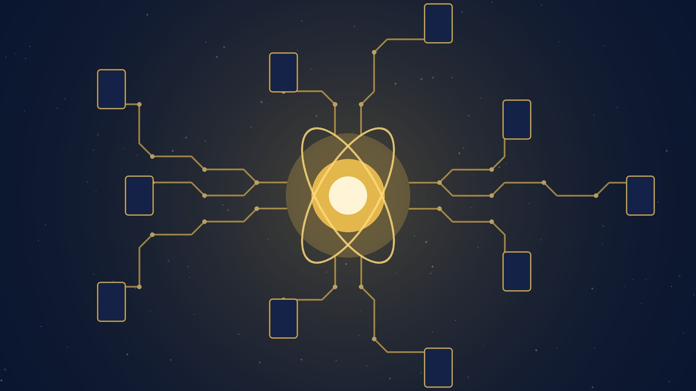

Si anoche te preguntabas dónde va a parar tanto GPU que andan comprando las big tech, acá va una respuesta parcial: **a la ciencia federal estadounidense**. En la cumbre "Science: A New Golden Age", la Casa Blanca anunció el **Genesis Mission**, un programa donde **once empresas comprometieron US$2.400 millones** en créditos de cómputo y herramientas de IA para agencias científicas e investigadores federales.

## Quién puso cuánto

El desglose, según la fact sheet de la Casa Blanca del 8 de octubre:

- **NVIDIA: US$1.000 millones** en capacidades de cómputo durante los próximos cinco años
- **AMD: US$500 millones**
- **OpenAI: US$200 millones** en descuentos de tokens y programas de entrenamiento para científicos
- **Anthropic y Google: US$150 millones cada una** (Anthropic en acceso a Claude por tres años)
- **AMP y Emerald AI: US$100 millones cada una**
- **AWS, Armada, Crusoe y Micron: US$50 millones cada una**

Ojo con el detalle: buena parte son **créditos, descuentos y acceso a plataformas, no cheques**. Anthropic misma describe su aporte como acceso a modelos, créditos de API y soporte — no grants. La "plata" granular depende de que los científicos efectivamente consuman estos servicios.

## Qué es el Genesis Mission

El vehículo es el **Genesis Mission Consortium**, un hub de colaboración público-privada que funcionará con working groups entre las empresas y las agencias científicas federales. La idea es conectar a investigadores de agencias (NIH, DOE, NASA y similares) con cómputo de clase mundial y modelos frontier sin que cada agencia negocie por su cuenta.

## El contexto que importa

- Esto llega **menos de dos semanas después del acuerdo voluntario de IA** firmado en la Casa Blanca con OpenAI, Anthropic, Google, Meta, xAI y Nvidia (29 de septiembre). La correlación no es casual: el gobierno está usando el acceso a cómputo como moneda de cambio para la cooperación de la industria.
- **OpenAI regalando tokens y Anthropic regalando Claude a científicos** también es una jugada de distribución: capturar workflows de investigación federales temprano es tráfico de primera calidad para sus modelos.
- Para los equipos de infraestructura, la señal es directa: **la demanda agregada de cómputo para IA sigue absorbiendo todo lo que se construye** — ahora con la ciencia federal como cliente de línea.

En resumen: US$2.400 millones en cómputo comprometidos para investigación científica con IA, once empresas en el tren, y un gobierno que sigue tratando el cómputo como infraestructura estratégica nacional. El Genesis Mission acaba de nacer, pero el patrón ya lo conocemos: quien controla los GPUs, controla la agenda.

**Fuentes:** [POLITICO](https://www.politico.com/news/2026/10/08/tech-firms-pledge-2-4-billion-in-computing-power-to-trumps-genesis-mission-01111708) · [FedScoop](https://fedscoop.com/genesis-mission-investment-nvidia-google-anthropic-openai/) · [PYMNTS](https://www.pymnts.com/news/artificial-intelligence/2026/tech-giants-contribute-2-billion-dollars-ai-resources-white-house-science-mission/)
