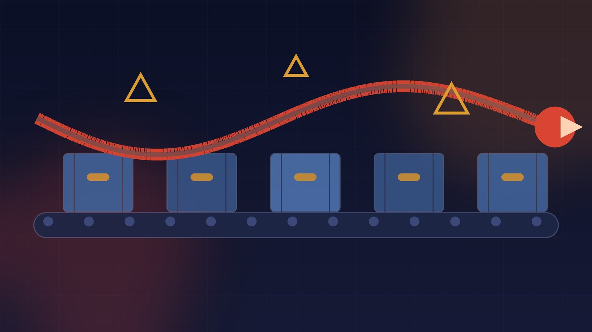

El worm de supply chain **Shai-Hulud** (aka ChainDrop) volvió a dar que hablar, y esta vez la víctima fue **tensorlake**, el SDK de TypeScript para la plataforma de indexing de documentos con IA. La versión maliciosa **0.5.144 se publicó en npm el 8 de octubre a las 01:12 UTC**, y [Socket la detectó a las 01:23](https://socket.dev/blog/tensorlake-compromise) — 11 minutos después. Velocidad de detección récord; el problema es todo lo demás.

## Cómo entró: lo que más asusta

Según el análisis de [Socket y StepSecurity](https://socket.dev/blog/tensorlake-compromise), la cadena del ataque fue quirúrgica:

- **Commits aterrizaron en la rama main bajo el nombre de un maintainer** legítimo.
- **El workflow de release del propio proyecto publicó la 0.5.144** — o sea, el pipeline oficial, no una subida manual sospechosa.
- El paquete salió con una **provenance attestation real de npm**, porque desde el punto de vista de la infraestructura, todo era un release normal.
- Un **hook de preinstall** descargó un payload ofuscado que se lleva todo lo que encuentra.

La lección incómoda: **la provenance attestation no te salva cuando el ataque ocurre aguas arriba de ella**. El paquete estaba "legítimamente" firmado porque el repo mismo estaba comprometido. Si tu estrategia de supply chain confía en attestations sin verificar el proceso que las produce, esto es tu aviso.

## Qué roba

El payload de Shai-Hulud es un verdadero aspirador de estación de trabajo de desarrollo:

- **Tokens de GitHub y npm** (para republicar paquetes comprometidos y propagar el worm — sí, es autoreplicante a nivel ecosistema)
- **Claves de nube** (AWS y compañía)
- **Secretos de Kubernetes y Vault**
- **Llaves SSH y sesiones de navegador**
- **Configs de herramientas de coding con IA**

Y de regalo: evasión de EDR y comportamiento de wiper — la marca de la casa de Shai-Hulud, que ya hizo historia [wipiando workstations](https://thehackernews.com/2026/10/tensorlake-npm-package-compromised-to.html) en campañas anteriores.

## Qué hacer ahora

- Si tienes `tensorlake@0.5.144` en algún lockfile: **elimínalo y rota TODOS los credenciales** que pudieron tocar esa máquina. No solo los del proyecto.
- Pinea la versión anterior limpia y revisa los runs de CI posteriores al commit intruso ([Endor Labs documenta el run de release](https://www.endorlabs.com/learn/tensorlake-npm-package-compromised-by-shai-hulud-in-latest-software-supply-chain-attack) comprometido).
- Audita sesiones activas de GitHub/npm y revisa si se publicó algo desde tus tokens.

## El patrón que no se detiene

Ataques a maintainers, commits suplantados y releases "oficiales" con malware ya no son exoticos: son el modus operandi estándar contra el ecosistema npm/PyPI. La pregunta ya no es si tu dependencia favorita va a ser comprometida, sino cuánto vas a detectar cuando pase. Herramientas de escaneo en el edge (Socket, Endor, StepSecurity) demostraron que los 11 minutos de detección son posibles — pero la rotación de secretos y el response siguen siendo manual, lento y doloroso.

**Fuentes:** [Socket](https://socket.dev/blog/tensorlake-compromise), [The Hacker News](https://thehackernews.com/2026/10/tensorlake-npm-package-compromised-to.html), [Endor Labs](https://www.endorlabs.com/learn/tensorlake-npm-package-compromised-by-shai-hulud-in-latest-software-supply-chain-attack), [TechNadu](https://www.technadu.com/tensorlake-npm-sdk-0-5-144-compromised-in-chaindrop-shai-hulud-credential-stealing-attack/641095/)
